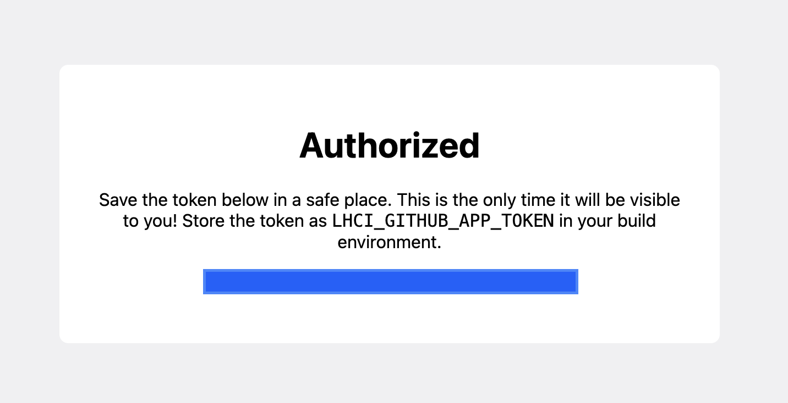
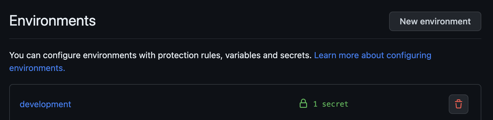
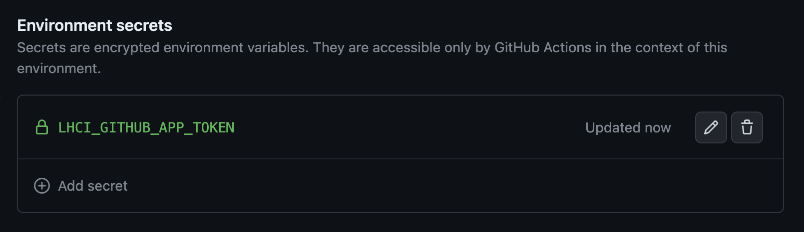
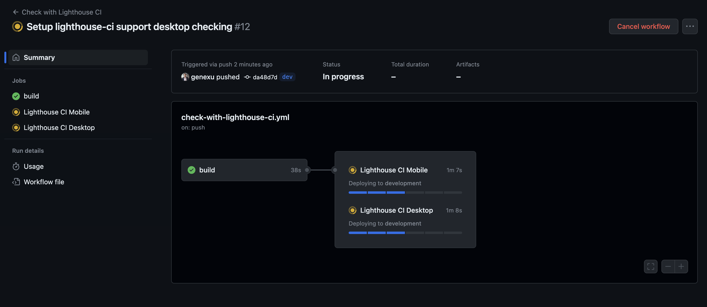
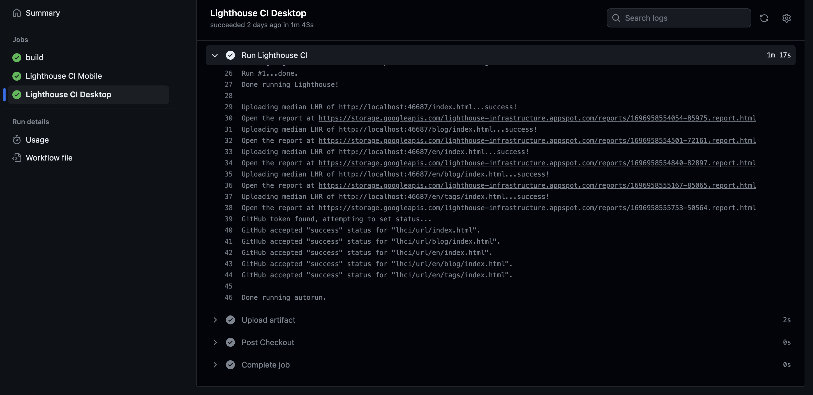
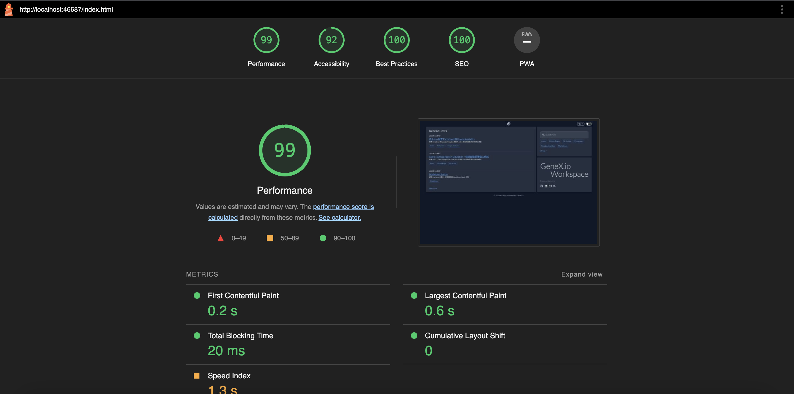
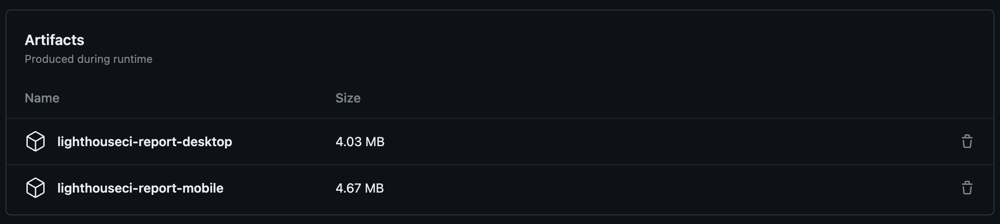

### Install the Lighthouse CI GitHub App and obtain the token

ref: <https://github.com/GoogleChrome/lighthouse-ci/blob/main/docs/getting-started.md#github-app-method-recommended>

Github App: <https://github.com/apps/lighthouse-ci>



### Create a repository secret

Create a repository environment secret named <code>LHCI_GITHUB_APP_TOKEN</code>, and enter the token obtained in the previous step.



### Create a GitHub Action workflow

Create a </code>.github/workflows/check-with-lighthouse-ci.yml</code> file in the project directory. This workflow is primarily divided into two parts: the first part is Build & Cache, and the second part is running Lighthouse CI. You can adjust it according to the project's requirements.

ref: [check-with-lighthouse-ci.yml](https://github.com/genexu/genexu.github.io/blob/main/.github/workflows/check-with-lighthouse-ci.yml)

#### Build & Cache

The "Build" part depends on the project's requirements and typically involves tasks like installing dependencies, building the project, and deploying it. Here, we'll skip the "Build" part to explain the "Cache" section.

```yaml
- name: Cache Dest
  id: cache-dest
  uses: actions/cache@v3
  with:
      path: ${{ env.BUILD_PATH }}/dist
      key: ${{ runner.os }}-${{ github.run_number }}-dest
```

The primary purpose of caching here is to store the completed file paths from the "Build" step and share them among different jobs to accelerate the workflow's execution speed. If the cache key is the same, it will use the cache; if the key is different, it will create a new cache.

In this context, we will cache the <code>/dist</code> directory，using <code>runner.os</code> and <code>github.run_number</code> as the key.

#### Lighthouse CI

-   Restore Cache
-   Install & Run Lighthouse CI
-   Report & Artifact

Restore the filepath cached in the previous step to the current job.

```yaml
- name: Restore cached dest
  id: cache-dest-restore
  uses: actions/cache/restore@v3
  with:
      path: ${{ env.BUILD_PATH }}/dist
      key: ${{ runner.os }}-${{ github.run_number }}-dest
```

Install Lighthouse CI and execute it. Here, we run Desktop and Mobile tests concurrently, with the main difference being the configuration file. The default path is lighthouserc.json for Mobile.

```yaml
- name: Install LHCI
  working-directory: ${{ env.BUILD_PATH }}
  run: |
      yarn global add @lhci/cli@0.12.x

- name: Run Lighthouse CI
  run: |
      lhci autorun
    # lhci autorun --config=lighthouserc-desktop.json
  env:
      LHCI_GITHUB_APP_TOKEN: ${{ secrets.LHCI_GITHUB_APP_TOKEN }}
```

#### Configure the lighthouserc.json file

-   Mobile: [lighthouserc-mobile.json](https://github.com/genexu/genexu.github.io/blob/main/lighthouserc.json)
-   Desktop: [lighthouserc-desktop.json](https://github.com/genexu/genexu.github.io/blob/main/lighthouserc-desktop.json)

```json
{
	"ci": {
		"collect": {
			"numberOfRuns": 1,
			"settings": {
				"preset": "desktop"
			}
		},
		"upload": {
			"target": "temporary-public-storage"
		}
	}
}
```

You can adjust the settings here according to your specific needs, and reference the official documentation for relevant configuration options.
ref: <https://github.com/GoogleChrome/lighthouse-ci/blob/main/docs/configuration.md>

With this, you have completed the configuration of Lighthouse CI. Now, you can push your project to GitHub and observe the execution results of the workflow.

### Workflow Execution Results



The mentioned configuration <code>temporary-public-storage</code> will store the report in the temporary storage provided by Google, making it publicly accessible with a URL for viewing. It's set to be automatically deleted after a certain period.

Here, you can configure the upload of the Lighthouse CI Report to be stored in the GitHub Action artifacts within the workflow. Users can customize artifact storage space, retention days, and other settings according to their preferences.

```yaml
- name: Upload artifact
  uses: actions/upload-artifact@v3
  with:
      name: lighthouseci-report-mobile
    # name: lighthouseci-report-desktop
      path: ${{ env.BUILD_PATH }}/.lighthouseci
```



The current method for viewing the report is not very convenient. You can use the server provided by Lighthouse CI to view and compare reports from different versions, monitor metric changes, and more. In a subsequent article, we will introduce setting up the Lighthouse CI server and its related configurations.
