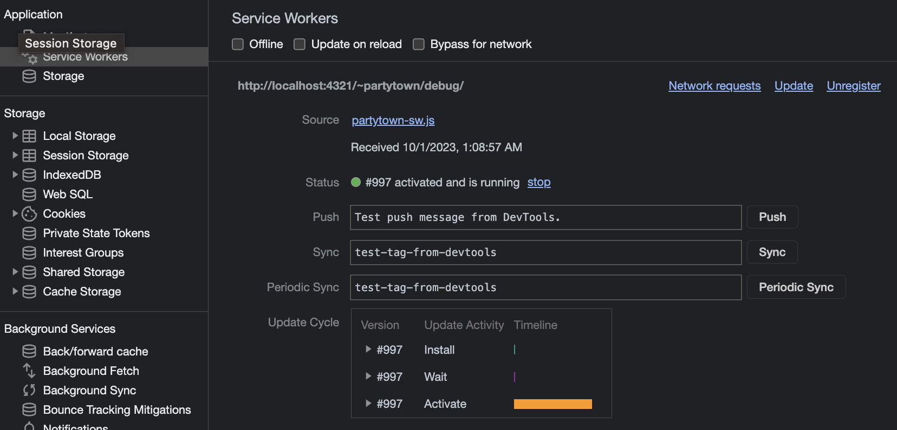
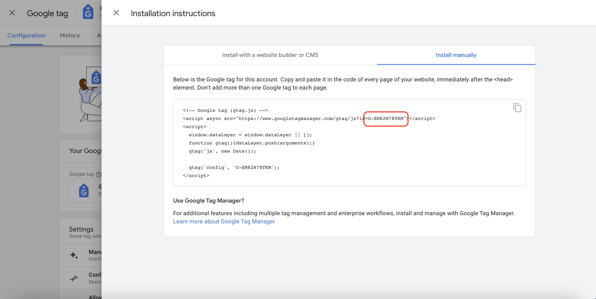
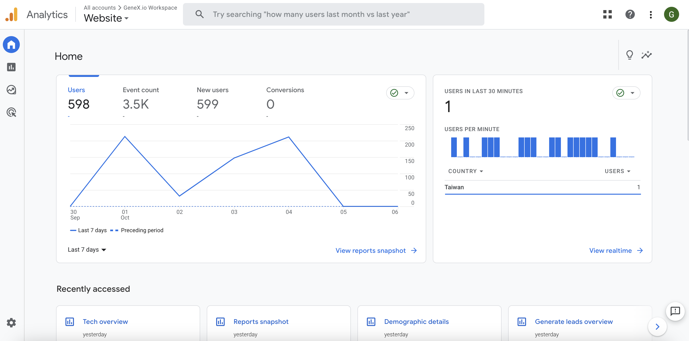

### What is Partytown

Partytown is a lazy-loaded library that assists in relocating resource-intensive scripts within a website to be executed in a web worker, preventing main thread blocking, and thereby enhancing application performance.



### Install Partytown

ref: <https://partytown.builder.io/astro>

```bash
~$ yarn astro add partytown
```

```js
import { defineConfig } from "astro/config";
import partytown from "@astrojs/partytown";

export default defineConfig({
	site: "YOUR_SITE_URL",
	integrations: [partytown()],
});
```

### Create Google Analytics component

Create a Google Analytics component for easy future use.

**Note**:

-   Add the type="text/partytown" attribute to each third-party \<script\> tag that needs to be processed by Partytown. This ensures that Partytown relocates these scripts for execution in a web worker.
-   Set the define:vars={{ id }} attribute to pass Astro.props.id into the \<script\>. This enables the use of Astro.props.id to configure the Google Analytics ID.

ref: <https://partytown.builder.io/partytown-scripts>

```astro
---
interface Props {
	id: string;
}

const { id } = Astro.props;
---
<!-- Google tag (gtag.js) -->
<script is:inline async
    type="text/partytown"
    src=`https://www.googletagmanager.com/gtag/js?id=${id}`
>
</script>
<script is:inline
    define:vars={{ id }}
    type="text/partytown"
>
	window.dataLayer = window.dataLayer || [];
	function gtag() {
		dataLayer.push(arguments);
	}
	gtag("js", new Date());

	gtag("config", id);
</script>
```

### Configure Google Analytics and obtain the Google Analytics ID



### Add the Google Analytics component to the website

```astro

<head>
    <!-- Google Analytics (use Google tag) -->
    <GoogleAnalytics id="YOUR_GOOGLE_ANALYTICS_ID" />
    ...
</head>
```

### Setup Partytown forward config

When communicating with third-party scripts, they often add variables to the 'window' object. However, in this case, our third-party script has already been relocated by Partytown to run in a web worker. Therefore, we need to use Partytown's forward config to relay these variables into the web worker.

ref: <https://docs.astro.build/en/guides/integrations-guide/partytown/#configforward>

```js
import { defineConfig } from "astro/config";
import partytown from "@astrojs/partytown";

export default defineConfig({
	site: "YOUR_SITE_URL",
	integrations: [
		partytown({
			config: {
				forward: ["dataLayer.push"],
			},
		}),
	],
});
```

### Verify that Google Analytics is functioning properly



Here, we are focusing on the project-specific configuration. For Google Analytics setup, you can refer to the official documentation. There may be an opportunity to write another article explaining how to configure Google Analytics in the future.
