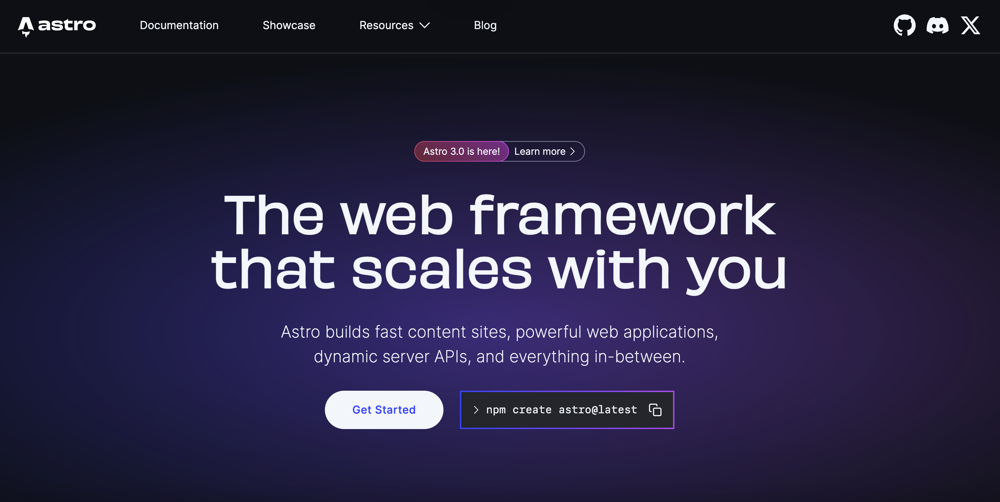
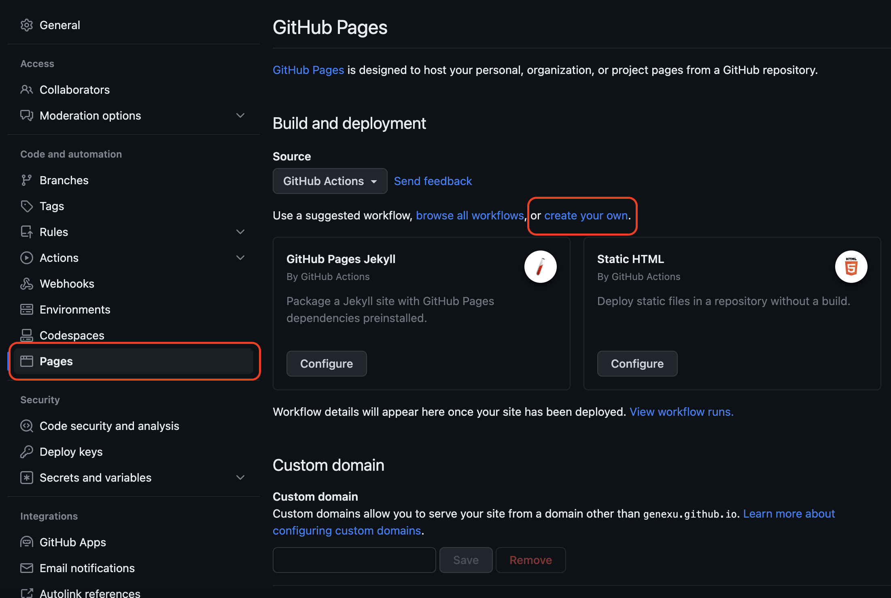
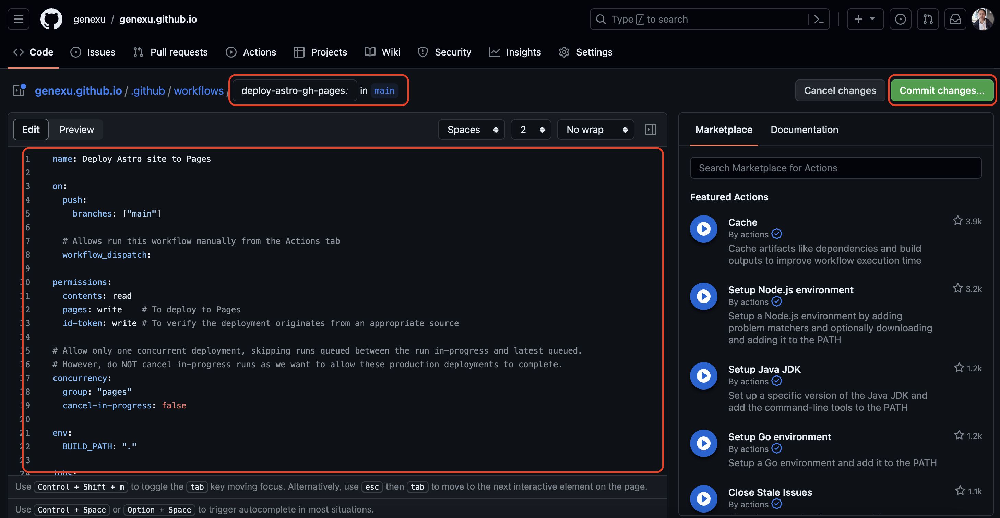
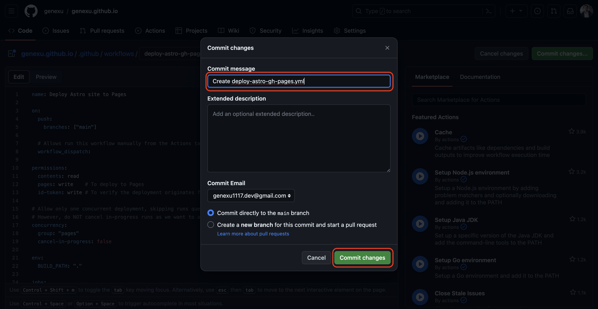
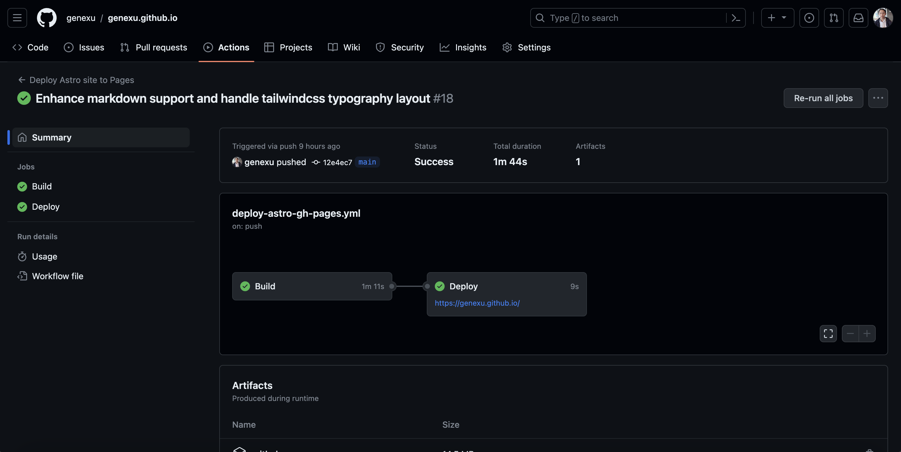

### What is Astro

Astro 是一個前端框架，強調以內容為中心，並引入 Component Islands 的概念，同時整合多個框架，例如 React、Vue、Svelte 等，讓開發者可以自由選擇自己熟悉的框架來開發，這讓想要建立 Blog 同時喜歡把玩各個框架的我，選擇 Astro 來建立我的個人網站。



### 建立 Astro 專案

<https://docs.astro.build/en/install>

```bash
~$ yarn create astro
```


### Push Astro 專案到 Github


### 設定 Github Pages

進入 Repository 的 Settings，找到 GitHub Pages，並設定 Source 為 GitHub Action，點選 Create your own 來建立一個新的 workflow。



### 設定 Github Action

此處有我已經設定好的 workflow，直接複製貼上即可。
[workflows/deploy-astro-gh-pages.yml](https://github.com/genexu/genexu.github.io/blob/main/.github/workflows/deploy-astro-gh-pages.yml)





### Github Action 部署

Boom! That's it. 之後每次 Git push 到 main branch 時，Github Action 就會自動 build & deploy 到 Github Pages。

點選 Actions，可以看到剛剛設定的 workflow，目前的設定是當有新的 commit push 到 main branch 時，就會觸發部署，點選 Run workflow 即可手動觸發。



從建立到部署就是如此簡單，為了不讓文章顯得複雜，會在之後的文章中說明此篇中 Github workflow 的設定，有興趣的朋友可以再 follow up。