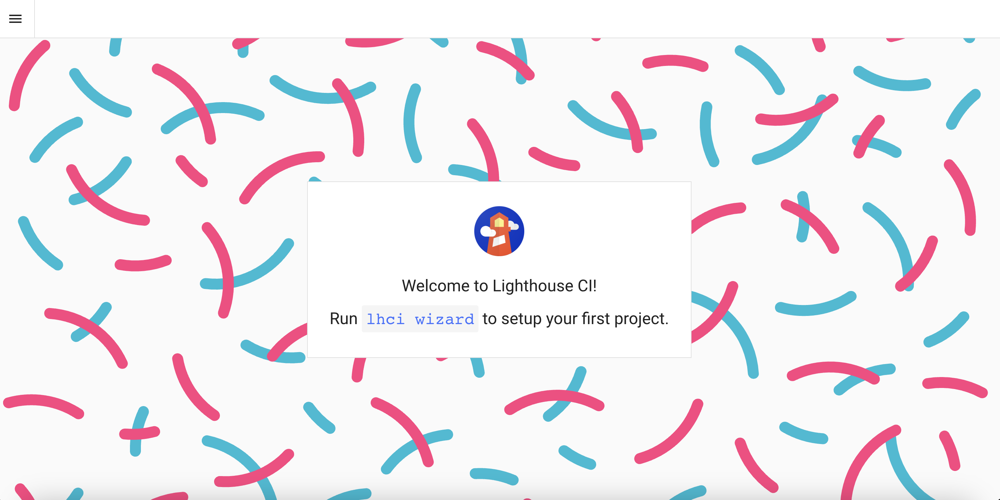
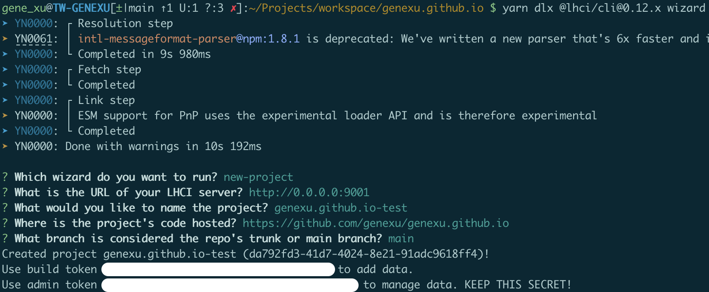
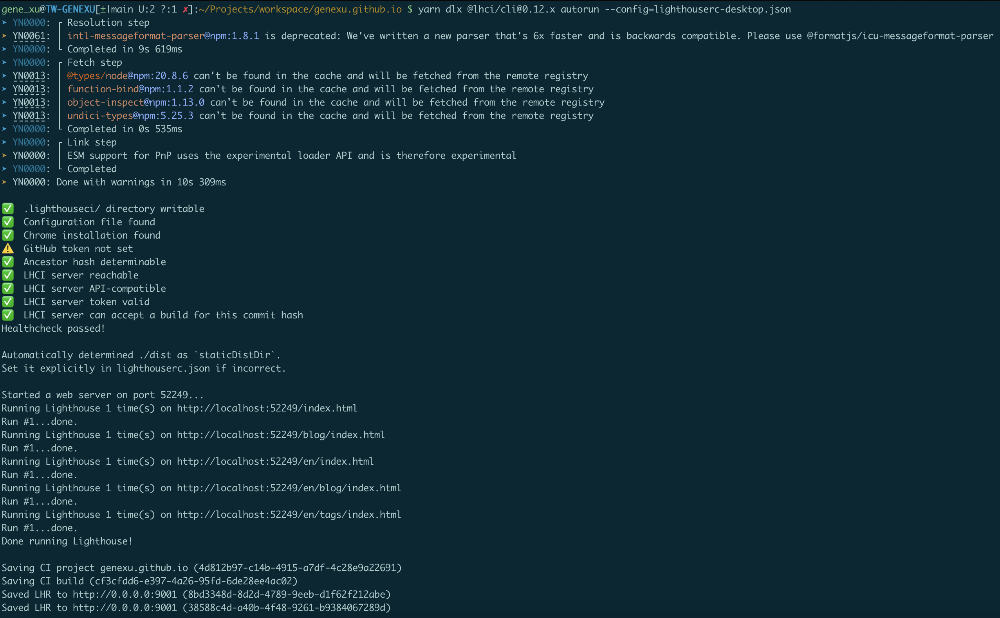
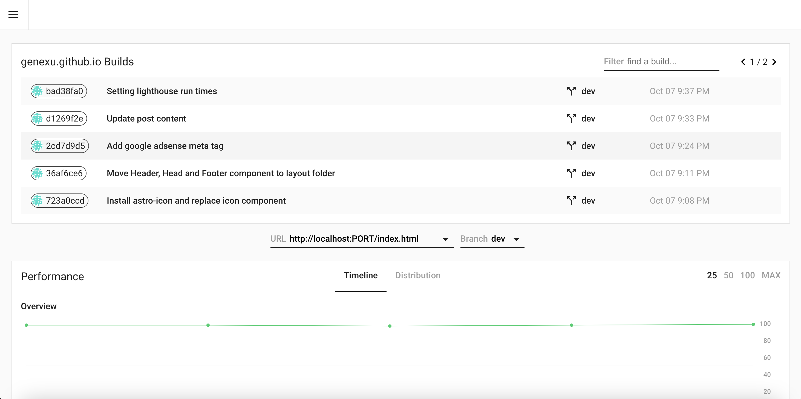
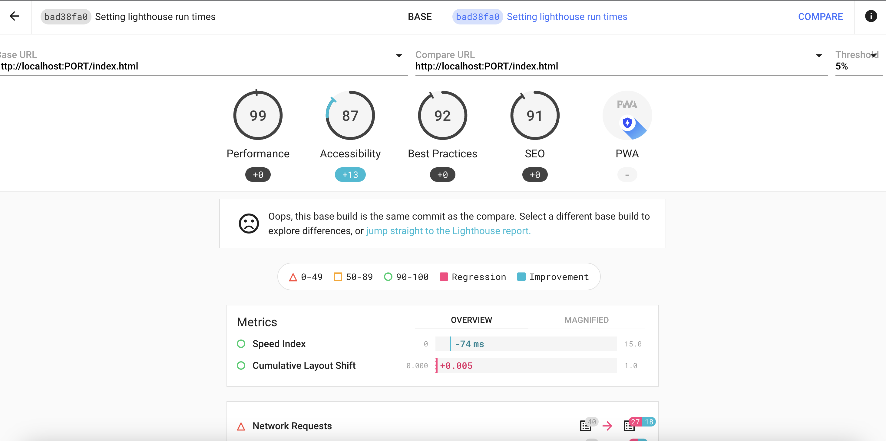

### 架設 Lighthouse CI Server

首先來架設 Lighthouse CI Server，這邊我們使用 Docker 來快速將 Server 設立起來，藉此來演示 Lighthouse CI 的使用方式，實際可根據自己的需求來架設。

ref: <https://github.com/GoogleChrome/lighthouse-ci/blob/main/docs/server.md#docker>

```bash
docker volume create lhci-data
docker container run --publish 9001:9001 --mount='source=lhci-data,target=/data' --detach patrickhulce/lhci-server
```

打開瀏覽器，輸入 <http://localhost:9001>，即可看到 Lighthouse CI Server 的畫面。



### 創建 Lighthouse CI Project

透過 <code>lhci wizard</code> 來設定 Project，並取得 Token。

```bash
yarn dlx @lhci/cli@0.12.x wizard
```



### 設定 lighthouserc.json 檔案

設定 CI Upload Target 以及 Server Base Url，並將 Token 填入。

```json
{
	"ci": {
		"upload": {
			"target": "lhci",
			"serverBaseUrl": "http://0.0.0.0:9001",
			"token": "YOUR_LHCI_SERVER_BUILD_TOKEN"
		}
	}
}
```

### 執行 Lighthouse CI

執行 Lighthouse CLI autorun，並指定設定檔，可看見其最後會將 Report 上傳至 Lighthouse CI Server。

```bash
yarn dlx @lhci/cli@0.12.x autorun --config=lighthouserc.json
```



### Lighthouse CI Server Report

可於 Lighthouse CI Server 上看見 Report，具備時間軸，可持續追蹤效能指標變化。


進入 Detail 頁面可進一步比較各個版本的 Report、指標變化等。


透過 Lighthouse CI Server 可以持續追蹤、比較效能指標，並且提供了一個簡易的介面，讓使用者可以更直覺的了解網站應用的效能變化，進而持續優化網站應用。
