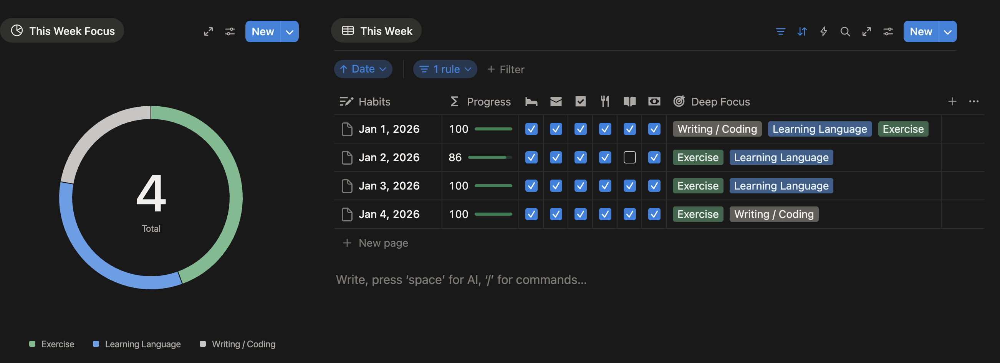
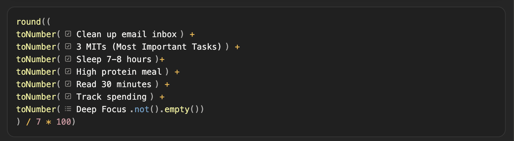
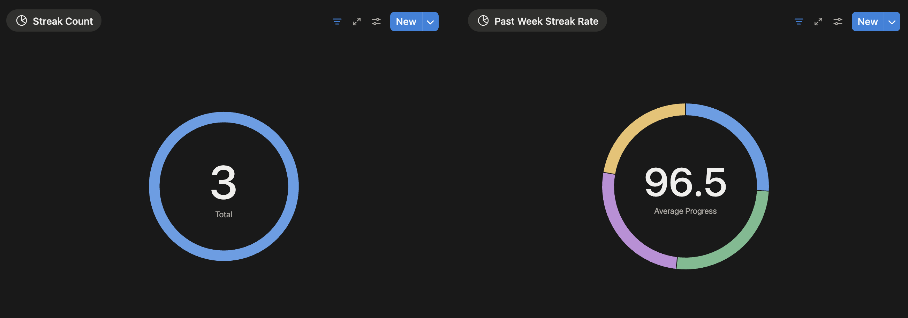
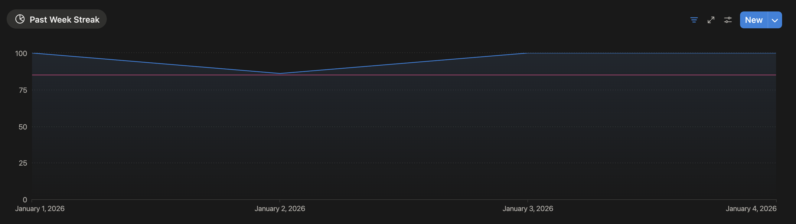

### Introduction
Inspired by the book Atomic Habits, I've been building my own Habit Tracker for quite some time now. Beyond the well-known compound effect of habits, this article aims to share the insights I've gained along the way and the Habit Tracker I built using Notion.

### Establishing Habits
Before building a Habit Tracker, the first step is to define the habits you want to develop. These habits can be anything—daily exercise, reading, meditation, or learning new skills. Many articles already cover how to establish habits, so I won't elaborate here. Instead, I'd like to share a few insights I've experienced:

> Start with simple ones

Include some simpler habits, such as drinking a glass of water when you wake up, organizing your email, or like soldiers who always make their beds in the morning. These habits don't require much time or energy but can bring positive impacts. When you complete these simple habits, you'll feel a sense of achievement, which motivates you to tackle more challenging habits.

> Don't treat yourself as a superhuman

I once added exercise, writing, and learning new skills (like languages or preparing for certifications)—all requiring deep focus—directly into my checklist simultaneously. But a person's time and energy each day are limited, especially when we also have to deal with work, family, and other responsibilities.

When I felt exhausted and finally realized I couldn't juggle so many habits at once, it created frustration and significantly reduced my execution power. Later, I learned to make "trade-offs." In addition to daily fixed habit items, I created a Deep Focus multi-select list where I can choose 1-2 habits requiring deep focus each day (or more if I have extra energy), along with weekly statistics to ensure these items develop in a balanced way.

### Streak Count & Streak Rate

Streak Count refers to consecutive days completed, but I simplified this condition to record the number of days completed within the year, transforming the frustration from breaking the original calculation method into motivation to complete more days.

At the same time, I can establish a reward system. By setting a target number of days for myself and giving myself rewards when achieved, I can motivate myself to keep moving forward.

> "Perfection is the enemy of progress." — Winston Churchill

When I first encountered this quote, I found it quite contradictory, as perfectionism seemed to represent the pursuit of excellence. However, as time passed and I accumulated more experience, I gradually understood the deeper meaning of this statement: the excessive pursuit of perfection actually hinders our progress. This traps us in a cycle of repeated restarts, unable to move forward consistently, which is particularly evident in habit building.

A person's daily state is not constant—sometimes energetic, sometimes exhausted, potentially fluctuating due to work pressure, sleep quality, or even weather changes. After acknowledging this reality, I no longer pursue 100% completion rate but set a more pragmatic goal for myself.

Although I simplified the definition of Streak Count, I added Streak Rate (completion rate) calculation and set a Baseline at 85%. This number ensures habit continuity while maintaining flexibility, preventing guilt from one or two "failures" on bad days. When the completion rate falls below the baseline, I know I need to adjust my strategy, identify the reasons, and improve.

Of course, as time goes by, you can also add other metrics, such as Monthly Average Progress, to help you understand your habit-building situation more comprehensively.

### Conclusion
In the process of building habits, I've realized that the focus is not on pursuing perfection but on continuous progress and adjustment. Habit formation is a dynamic process that requires constant reflection and improvement. Improving 1% each day results in 37 times growth after a year. Like a steady stream, finding the method that suits you best—this article is not a technical tutorial but an account of my insights and realizations while building my Habit Tracker. I hope it helps you.
