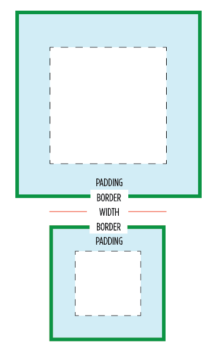

### Absolute units

<table>
    <thead>
        <tr>
            <th>Unit</th>
            <th>Description</th>
        </tr>
    </thead>
    <tbody>
        <tr>
            <td>px</td>
            <td>pixel (1px = 1/96th of 1in)</td>
        </tr>
        <tr>
            <td>pt</td>
            <td>point (1pt = 1/72 of 1in)</td>
        </tr>
        <tr>
            <td>pc</td>
            <td>pica (1pc = 12 pt)</td>
        </tr>
        <tr>
            <td>cm</td>
            <td>centimeter</td>
        </tr>
        <tr>
            <td>mm</td>
            <td>millimeter</td>
        </tr>
        <tr>
            <td>in</td>
            <td>inch (1in = 96px = 2.54cm)</td>
        </tr>
    </tbody>
</table>

### Relative units

<table>
    <thead>
        <tr>
            <th>Unit</th>
            <th>Description</th>
        </tr>
    </thead>
    <tbody>
        <tr>
            <td>rem</td>
            <td>relative to font-size of the root element</td>
        </tr>
        <tr>
            <td>em</td>
            <td>relative to font-size of the parent element</td>
        </tr>
        <tr>
            <td>%</td>
            <td>relative to parent element</td>
        </tr>
        <tr>
            <td>vw</td>
            <td>relative to 1% of the width of the viewport</td>
        </tr>
        <tr>
            <td>vh</td>
            <td>relative to 1% of the height of the viewport</td>
        </tr>
        <tr>
            <td>vmin</td>
            <td>relative to 1% of viewport's smaller dimension</td>
        </tr>
        <tr>
            <td>vmax</td>
            <td>relative to 1% of viewport's larger dimension</td>
        </tr>
        <tr>
            <td>ex</td>
            <td>relative to x-height of the current font</td>
        </tr>
        <tr>
            <td>ch</td>
            <td>relative to width of the "0" (zero)</td>
        </tr>
    </tbody>
</table>

### Box model

-   Content area
-   Padding area
-   Border area
-   Margin area

### Box sizing

Suppose:
width = 100px, padding = 10px, border = 10px

-   content-box (default)
    content size = width(100), total size = content(100) + padding(10) + border(10) = 120px
-   border-box
    content size = width(100) - padding(10) - border(10) = 80px, total size = width = 100px

### Line height

The content-area is not always the same as the font-size, it depends on the font metrics.

***IMPORTANT: we should pay attention to the line height when we use unitless (relative) value.***

The line height with unitless value are font-size relative, it may cause virtual-area smaller than the content-area.

Reference:
\- [CSS Units - W3S](https://www.w3schools.com/cssref/css_units.php)
\- [Introduction to the CSS basic box model - MDN](https://developer.mozilla.org/en-US/docs/Web/CSS/CSS_box_model/Introduction_to_the_CSS_box_model)
\- [Box Sizing - CSS Tricks](https://css-tricks.com/box-sizing)
\- [Deep dive CSS: font metrics, line-height and vertical-align - Vincent De Oliveira](https://iamvdo.me/en/blog/css-font-metrics-line-height-and-vertical-align)
